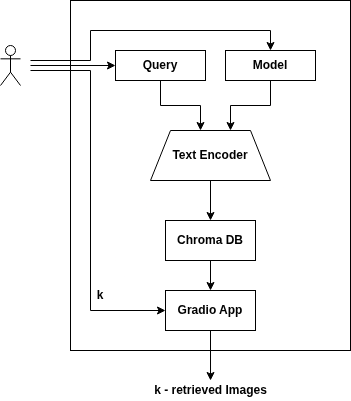

# Text-to-Image Retrieval with CLIP and SigLIP

A **dual-model semantic retrieval system** that **maps natural language queries** to
**visually relevant images** via vector search. Built on the Flickr8k
benchmark with a persistent ChromaDB index and a Gradio web interface.  
To try the app follow this link : [Text-to-ImageApp](https://huggingface.co/spaces/Andy-6/Text-to-ImageApp)

---

## Architecture




Embeddings are computed **once** at index time (`build_index.py`) and stored in
separate per-model collections. At query time only the text branch runs, keeping
latency low.

---

## Desired Repository Layout 

```
.
├── app.py              # Gradio web server
├── build_index.py      # Offline index builder
├── environment.yml     # Conda environment
├── .gitattributes      # Git LFS rules for images & ChromaDB
├── data/
│   └── images/         # 256×256 JPEG thumbnails  [LFS]
└── chroma_db/          # Persistent vector store   [LFS]
```

> `data/images/` and `chroma_db/` are tracked with **Git LFS**
> (`filter=lfs diff=lfs merge=lfs -text`).

---

## Setup

```bash
# 1. Clone (with LFS objects)
git lfs install
git clone https://github.com/Andreathegm/Text-to-Image-Retrieval-app.git

# 2. Recreate the conda environment
conda env create -f environment.yml
conda activate TTIR-app
```

> **CUDA note** — `torch==2.10.0+cu126` and `torchvision==0.25.0+cu126` are
> distributed on PyTorch's own index, not PyPI. The `environment.yml` already
> includes `--extra-index-url https://download.pytorch.org/whl/cu126` so the
> install should resolves automatically. Otherwise install it by yourself following  instuction at [pytorch.org](https://pytorch.org/) . You shoud definetely follow those if your set-up is different than Linux + CUDA

```bash
# 3. Build the vector index (GPU recommended)
python build_index.py --model-type clip
python build_index.py --model-type siglip

# 4. Launch the app
python app.py
```
After launching the app it will be displayed at local-host.
If `data/images/` is absent, the Flickr8k dataset is fetched automatically
from `jxie/flickr8k` on HuggingFace at both index-build and inference time.

---

## Index Builder Arguments (`build_index.py`)

| Argument | Default | Description |
|---|---|---|
| `--model-type` | — | `clip` or `siglip` (required) |
| `--batch-size` | 64 | Images per forward pass |
| `--splits` | all | `train`, `validation`, `test` |
| `--force` | off | Drop and rebuild the collection |

The builder L2-normalises all embeddings before upsert; ChromaDB collections
use `hnsw:space = cosine` for approximate nearest-neighbour(ANN) retrieval.

---

## Models

| Model | HuggingFace ID | Embed dim |
|---|---|---|
| CLIP | `openai/clip-vit-base-patch16` | 512 |
| SigLIP | `google/siglip-base-patch16-224` | 768 |

Both models expose `get_text_features` / `get_image_features` through the
`transformers` `AutoModel` API, allowing the codebase to remain
architecture-agnostic.

---
## Scripts implementation

- **build_index-py**  

    **General Pipeline Logic** :  
    The script implements (ETL:Extract-Trasform-Load) pipeline for image data. It fetches the Flickr8k dataset using memory-mapped Apache Arrow structures (I just using load_dataset() ), processes the images using Transformers (CLIP or SigLIP) to extract features and normalizes them. Finally, it persists these embeddings into a local ChromaDB instance configured with an HNSW (Hierarchical Navigable Small World) graph for efficient approximate nearest neighbor (ANN) search, while saving downsampled thumbnails to disk

    - `encode_batch(images, model, processor, device)`
        Converts raw PIL images into batched PyTorch tensors, extracts pooled features from the model, applies $L_2$ normalization, and detaches the tensor back to a NumPy array.

    - `flush_to_chroma(collection, embeddings, ids, metadatas)`
        Pushes chunks of dense vectors, their string identifiers, and associated metadata into the ChromaDB collection.
        It uses `.upsert()` (Update/Insert) instead of `.add()`. Upsert performs a primary key collision check: if the ID already exists in the SQLite backend, it updates the vector in the HNSW graph; if not, it inserts it. This ensures idempotency and prevents index corruption during interrupted runs.

- **app.py**  
    The script implements an interactive web interface (Gradio) for real-time text-to-image retrieval. At startup, it pre-loads pre-trained Vision-Language models (CLIP and SigLIP) establishes persistent connections to their respective ChromaDB collections. During inference, it tokenizes and encodes user text prompts into vectors and executes ANN cosine searches against the HNSW graph to retrieve and render the top-k matching images.

    - `load_image(meta: dict)`
       Fetches the visual payload for the UI. It implements an I/O fallback mechanism: prioritizing direct local disk reads for pre-computed JPEG thumbnails, and defaulting memory-mapped reads (Apache Arrow) via the Hugging Face `datasets` library if local files are absent.

    - `retrieve(query, model_choice, top_k)`
       Executes the core inference and search loop. It tokenizes the text, bypasses the PyTorch autograd engine via `torch.inference_mode()` and extracts text embeddings. It explicitly applies $L_2$ normalization (`torch.nn.functional.normalize`) Finally, it uses ChromaDB's `.query()` to efficiently traverse the vector index and fetch the closest matches.

---
### References
https://techascent.com/blog/memory-mapping-arrow.html (memory-mapping)  

https://docs.trychroma.com/docs (Chroma)  

https://gradio.app/guides/quickstart (Gradio)  

https://arxiv.org/pdf/2303.15343 (Sigmoid Loss for Language Image Pre-Training)  

https://www.youtube.com/watch?v=chz74Mtd1AA (Explanation of ANN and HNSW)

### AI usage
https://gemini.google.com/gem/f94e84ceea07/6df449e83abaf3ed  

https://claude.ai/chat/8a9bda37-77cb-44e3-9410-2ff55aa1a762(for writing a draft of this readme file and also helped me manage better the reproducibilty of the conda env.)

I used AI assistance to generate the Gradio UI section of the script. For the remaining parts, I implemented the functions myself, although in a few cases I relied on AI to help me debug and implement some operations, which I subsequently verified against the official API documentations.

Since I initially implemented everything in a sort of monolithic structure, I used AI to add some print statements and put the code in a nicer way. However, I know it would be better to split the code into a more modular structure.

